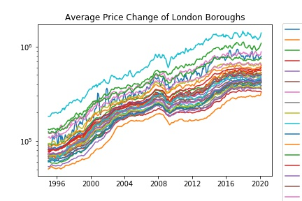
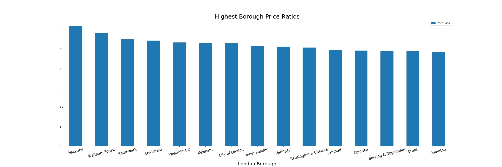

# London-Housing
Discovering which boroughs of London have seen the greatest average increase in housing prices over the past two decades using a dataset from the London Datastore.

Here are the average price changes from 1995 to 2019 for properties in each borough of London.

These are the boroughs with the highest property price ratios over the past two decades. Properties in Hackney, Waltham Forest, and Southwark seem to have increased in value the most over the past twenty years compartively to those of other London boroughs.

After exploring the London Housing Prices dataset, it seems as though Hackney has seen the greatest housing price increase comparatively to other London boroughs from 1998 to 2018, followed by Waltham Forest and Southwark. This was determined using each borough’s price ratio over the past twenty years, or their average housing price in 2018 divided by their average housing price in 1998. Another look at the percent change of the log-adjusted average price during that time frame confirms that the housing price in Hackney increased the most per year on average.
