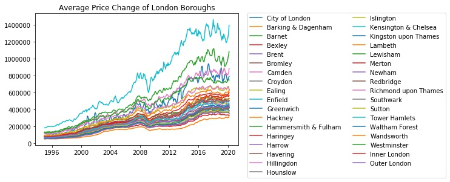

# London-Housing
Discovering which boroughs of London have seen the greatest average increase in housing prices over the past two decades using a dataset from the London Datastore.

Here are the average price changes from 1995 to 2019 for properties in each borough of London.

These are the boroughs with the highest property price ratios over the past two decades. Properties in Hackney, Waltham Forest, and Southwark seem to have increased in value the most over the past twenty years compartively to those of other London boroughs.

